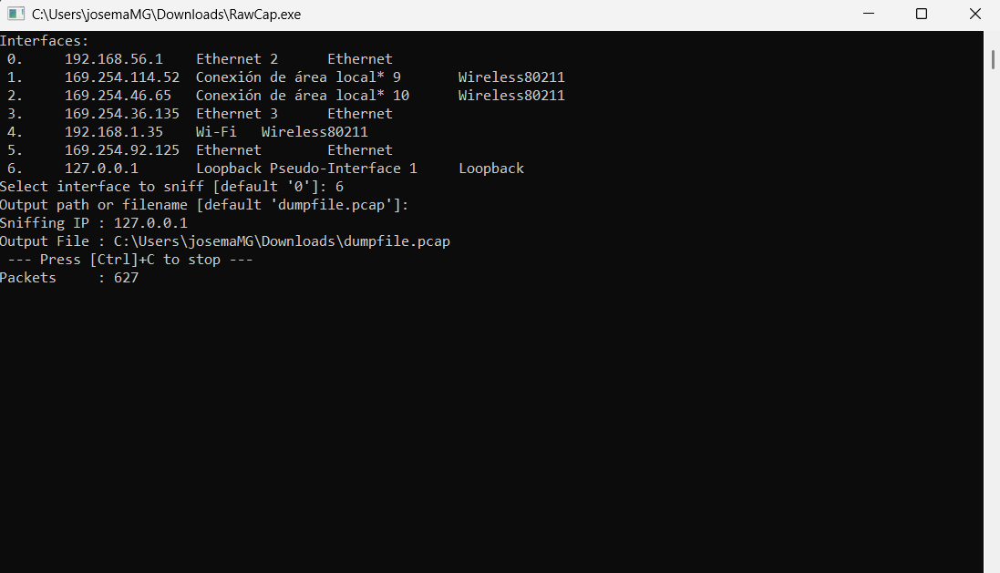
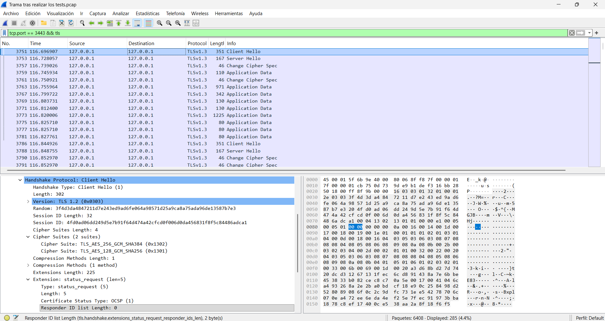
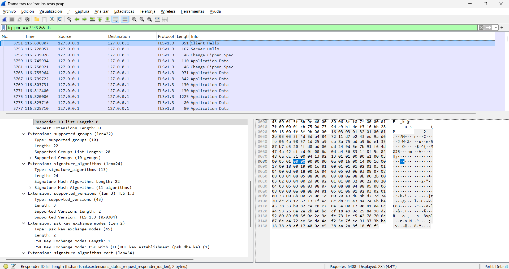
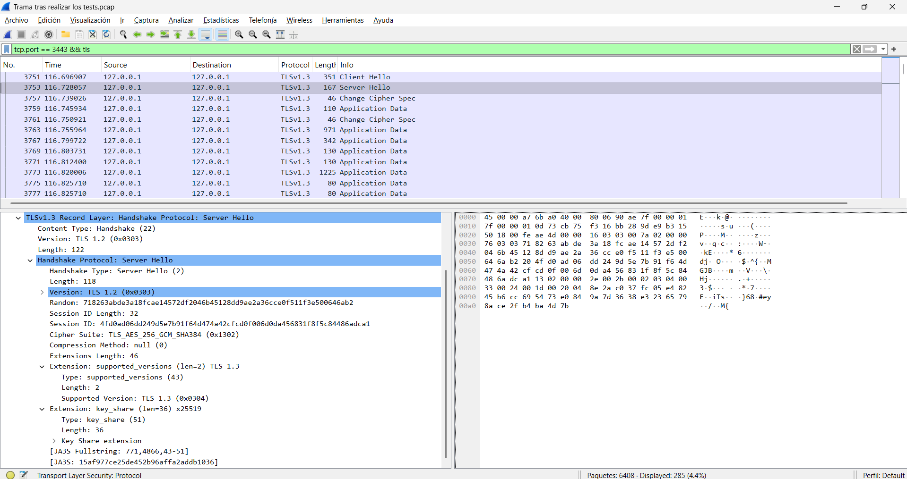
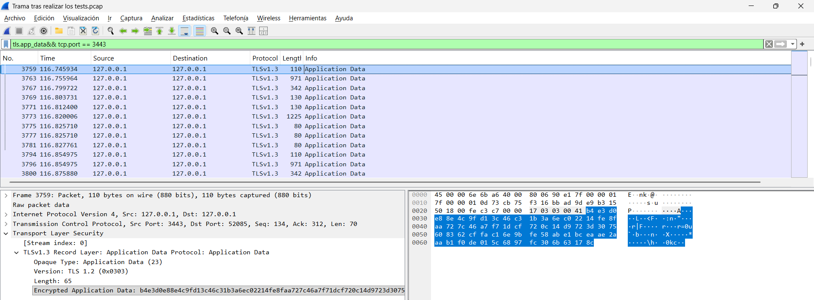

# Guía Completa de Pruebas — VPN SSL BYOD

Instrucciones paso a paso para ejecutar todas las pruebas: funcionales (JUnit 5), rendimiento (300 clientes), análisis criptográfico (Wireshark) y ataque MitM (Python PoC).

---

## 1. Pruebas Funcionales (JUnit 5)

### Compilar

```cmd
javac -d classes -cp ".;sqlite-jdbc-3.47.2.0.jar;lib/*" test\TestFuncionalSSL.java
```

### Ejecutar (requiere servidor SSL activo)

**cmd:**

```cmd
java -Djavax.net.ssl.trustStore=cliente_truststore.jks -Djavax.net.ssl.trustStorePassword=cambiame -jar lib\junit-platform-console-standalone-1.10.2.jar -cp "classes;sqlite-jdbc-3.47.2.0.jar" --select-class=TestFuncionalSSL
```

**PowerShell** (flags `-D` entrecomillados):

```powershell
java "-Djavax.net.ssl.trustStore=cliente_truststore.jks" "-Djavax.net.ssl.trustStorePassword=cambiame" -jar lib\junit-platform-console-standalone-1.10.2.jar -cp "classes;sqlite-jdbc-3.47.2.0.jar" --select-class=TestFuncionalSSL
```

> **Nota:** El fichero `TestFuncionalSSL.java` se encuentra en `test/`. Los resultados se guardan automáticamente en `logs/TestFuncionalSSL_<fecha>.log`.

### Tests incluidos

| # | Test | Valida |
|---|---|---|
| 01 | `testConexionTLS13` | Protocolo TLSv1.3 + cipher suite AES-GCM |
| 02 | `testRegistroExitoso` | Registro de nuevo usuario → OK |
| 03 | `testRegistroDuplicado` | Registro duplicado → ERROR |
| 04 | `testLoginExitoso` | Login correcto → OK |
| 05 | `testLoginIncorrecto` | Login con contraseña errónea → ERROR |
| 06 | `testBruteForceBloqueo` | 5 fallos → 6º devuelve BLOQUEADO |
| 07 | `testMensajeExitoso` | Mensaje ≤144 chars → OK |
| 08 | `testMensajeLargo` | Mensaje >144 chars → ERROR |
| 09 | `testMensajeSinLogin` | Mensaje sin autenticar → ERROR |
| 10 | `testHistorial` | Historial contiene mensajes enviados |
| 11 | `testLogout` | Cerrar sesión → OK |
| 12 | `testLogoutSinSesion` | Logout sin sesión → ERROR |
| 13 | `testComandoInvalido` | Comando inexistente → ERROR |
| 14 | `testIntegridadBD` | HMAC de todas las filas verificado |
| 15 | `testUsuariosPreregistrados` | Login admin/Admin2024! → OK |

---

## 2. Prueba de Rendimiento CON SSL (300 Clientes)

### Compilar

```cmd
javac -d classes -cp ".;sqlite-jdbc-3.47.2.0.jar" test\PruebaRendimiento.java
```

### Ejecutar (requiere servidor SSL activo)

**cmd:**

```cmd
java -cp "classes;sqlite-jdbc-3.47.2.0.jar" -Djavax.net.ssl.trustStore=cliente_truststore.jks -Djavax.net.ssl.trustStorePassword=cambiame PruebaRendimiento
```

**PowerShell:**

```powershell
java -cp "classes;sqlite-jdbc-3.47.2.0.jar" "-Djavax.net.ssl.trustStore=cliente_truststore.jks" "-Djavax.net.ssl.trustStorePassword=cambiame" PruebaRendimiento
```

> Los resultados se guardan automáticamente en `logs/PruebaRendimiento_<fecha>.log`.

### Métricas reportadas (Datos PruebaRendimiento_2026)

- **Clientes exitosos / errores**: 300 exitosos / 0 errores
- **Tiempo medio, mínimo, máximo**: Media: 63975,5 ms, Mínimo: 46614 ms, Máximo: 73163 ms
- **P95**: 72002 ms
- **Throughput**: 4,08 cli/s

---

## 2b. Prueba de Rendimiento SIN SSL (300 Clientes, benchmark)

Esta prueba usa sockets TCP planos para medir tiempos sin el overhead de TLS.

### Compilar

```cmd
javac -d classes -cp ".;sqlite-jdbc-3.47.2.0.jar" Protocolo.java SeguridadUtil.java BaseDatos.java test\PruebaRendimientoSinSSL.java ModeloSinSSL\ServidorSinSSL.java ModeloSinSSL\ClienteSinSSL.java
```

### Paso 1: Arrancar el servidor sin SSL

```cmd
java -cp "classes;sqlite-jdbc-3.47.2.0.jar" ServidorSinSSL
```

> El servidor sin SSL escucha en el **puerto 3080**. No requiere keystore.

### Paso 2: Ejecutar la prueba de rendimiento sin SSL

**cmd:**

```cmd
java -cp "classes;sqlite-jdbc-3.47.2.0.jar" PruebaRendimientoSinSSL
```

**PowerShell:**

```powershell
java -cp "classes;sqlite-jdbc-3.47.2.0.jar" PruebaRendimientoSinSSL
```

> No requiere truststore ni parámetros `-D`. Los resultados se guardan automáticamente en `logs/PruebaRendimientoSinSSL_<fecha>.log`.

### Métricas reportadas (Datos PruebaRendimientoSinSSL_2026)

- **Clientes exitosos / errores**: 300 exitosos / 0 errores
- **Tiempo medio, mínimo, máximo**: Media: 63170,7 ms, Mínimo: 38569 ms, Máximo: 71476 ms
- **P95**: 70367 ms
- **Throughput**: 4,16 cli/s

### Uso interactivo del modelo sin SSL

También se puede probar manualmente con el cliente interactivo:

```cmd
java -cp "classes" ClienteSinSSL
```

> Funcionalidad idéntica al `ClienteSSL` pero sin cifrado. Útil para verificar que la lógica de negocio funciona aislada del TLS.

--------------

## Metodología SSL vs Texto Plano

Cálculo de la "pérdida de rendimiento" por usar TLS comparando ambos benchmarks:

1. **Paso A (Media TLS)**: 63975,5 ms
2. **Paso B (Media sin TLS)**: 63170,7 ms
3. **Cálculo**: `Overhead TLS = ((63975,5 - 63170,7) / 63170,7) × 100% = 1,27%`

> **Conclusión**: El overhead originado por el apretón de manos TLS 1.3 y el cifrado continuo en la carga seleccionada supone aproximadamente un incremento del **1,27%** en la latencia media frente a un canje en texto plano. Que resulta irrisorió con tal de mantener la seguridad de la comunicación.

---

## 3. Análisis Criptográfico con Wireshark

### 3.1 Captura de tráfico en localhost

#### RawCap

1. Descargar **RawCap** desde <https://www.netresec.com/?page=RawCap>
2. Ejecutar el ejecutable RawCap.exe previamente instalado dando las opciones mostradas a continuación:



3. Ejecutar servidor + cliente mientras RawCap captura.
4. Detener con Ctrl+C y abrir `dumpfile.pcap` en Wireshark.

### 3.2 Filtros de Wireshark

A continuación se ponen los filtros que se pueden usar en la barra de filtro de Wireshark para analizar el tráfico capturado:

| Filtro | Propósito |
|---|---|
| `tcp.port == 3443` | Ver todo el tráfico del servidor |
| `tls` | Solo paquetes TLS |
| `tls.handshake` | Solo paquetes de handshake TLS |
| `tls.handshake.type == 1` | ClientHello |
| `tls.handshake.type == 2` | ServerHello |
| `tls.app_data` | Muestra las tramas que tienen Application Data (datos cifrados) |

### 3.3 Evidencias de que TLS 1.3 funciona correctamente

#### A) Negociación TLS 1.3 correcta

1. A continuación se muestra como el cliente se conecta al servidor:





Como se puede ver en los campos del ClientHello, el cliente ha solicitado la negociación de TLS 1.3 y ha ofrecido los siguientes algoritmos de cifrado esto lo sabemos porque:
   - **Supported Versions Extension**: debe mostrar `TLS 1.3 (0x0304)`
   - **Cipher Suites**: debe incluir `TLS_AES_256_GCM_SHA384` y `TLS_AES_128_GCM_SHA256`

2. A continuación se muestra como el servidor responde al cliente:



Como se puede ver en los campos del ServerHello, el servidor ha aceptado la negociación de TLS 1.3 y ha elegido uno de los algoritmos de cifrado esto lo sabemos porque:
   - **Supported Version**: `TLS 1.3 (0x0304)`
   - **Cipher Suite**: `TLS_AES_256_GCM_SHA384 (0x1302)`

#### B) Confidencialidad — Datos cifrados

A continuación se muestra como el cliente envía un mensaje al servidor:



Como se puede ver en los campos, se envían datos cifrados al servidor, esto lo sabemos porque:
   - **Opaque Type**: `Application Data (23)`
   - **Encrypted Application Data**: `[Contenido cifrado]`

#### C) Integridad — AES-GCM

TLS 1.3 con AES-GCM proporciona **AEAD** (Authenticated Encryption with Associated Data):

- Los datos se cifran Y se autentican con un MAC integrado.
- Cualquier modificación en tránsito sería detectada y la conexión se cerraría.

A continuación se vuelve a mostrar que el algoritmo de cifrado es AES-GCM:


---

## 4. Ataque Man-in-the-Middle (MitM)

### 4.1 Resumen

El ataque demuestra que un atacante que intercepta la comunicación entre cliente y servidor **NO puede** descifrar el tráfico porque:

- El cliente Java verifica el certificado del servidor contra su **TrustStore**.
- Un certificado falso genera `SSLHandshakeException` y la conexión se **rechaza**.

### 4.2 Ejecución del ataque

#### Paso 1: Arrancar el servidor real

**cmd:**

```cmd
java -cp "classes;sqlite-jdbc-3.47.2.0.jar" -Djavax.net.ssl.keyStore=servidor_keystore.jks -Djavax.net.ssl.keyStorePassword=cambiame ServidorSSL
```

**PowerShell:**

```powershell
java -cp "classes;sqlite-jdbc-3.47.2.0.jar" "-Djavax.net.ssl.keyStore=servidor_keystore.jks" "-Djavax.net.ssl.keyStorePassword=cambiame" ServidorSSL
```

#### Paso 2: Compilar y arrancar el proxy MitM (terminal 2)

```cmd
javac -d classes test\PruebaMitM.java test\ClienteSSLMitM.java
java -cp classes PruebaMitM
```

Esto:

- Genera un keystore con un certificado autofirmado **falso** via keytool.
- Levanta un proxy TLS en el **puerto 4443**.

#### Paso 3: Ejecutar el cliente MitM (terminal 3)

**cmd:**

```cmd
java -cp classes -Djavax.net.ssl.trustStore=cliente_truststore.jks -Djavax.net.ssl.trustStorePassword=cambiame ClienteSSLMitM
```

**PowerShell:**

```powershell
java -cp classes "-Djavax.net.ssl.trustStore=cliente_truststore.jks" "-Djavax.net.ssl.trustStorePassword=cambiame" ClienteSSLMitM
```

#### Resultado esperado

**En el cliente (terminal 3):**

```
✅ SSLHandshakeException capturada correctamente.
✅ El cliente RECHAZÓ el certificado falso del atacante.
✅ El TrustStore protege contra el ataque MitM.
```

**En el proxy MitM (terminal 2):**

```
[MitM] ✅ Handshake FALLIDO (esperado): [SSL: CERTIFICATE_REQUIRED]
[MitM] ✅ El cliente Java RECHAZÓ el certificado falso.
```

### 4.3 ¿Por qué funciona la protección?

```
┌─────────┐         ┌──────────────┐         ┌──────────────┐
│ Cliente  │ ──TLS──►│ Proxy MitM   │ ──TLS──►│ Servidor     │
│ Java     │         │ (cert falso) │         │ (cert real)  │
└─────────┘         └──────────────┘         └──────────────┘
     │                      │
     │  SSLHandshakeException!
     │  El truststore NO contiene
     │  el cert del proxy atacante.
     │  CONEXIÓN RECHAZADA ✅
```

1. El cliente Java solo confía en los certificados de `cliente_truststore.jks`.
2. El proxy presenta un certificado firmado por una CA diferente (autofirmado por el atacante).
3. Java detecta que el certificado no es de confianza → lanza `SSLHandshakeException`.
4. **Resultado**: la comunicación NUNCA se establece con el atacante.

### 4.4 Contraejemplo: ¿qué pasaría sin TrustStore?

Si el cliente aceptara cualquier certificado (configuración insegura con `TrustAllCerts`):

- El proxy MitM podría interceptar, leer y modificar todo el tráfico.
- Las credenciales de login serían visibles para el atacante.
- **Moraleja**: Nunca desactivar la verificación de certificados en producción.
